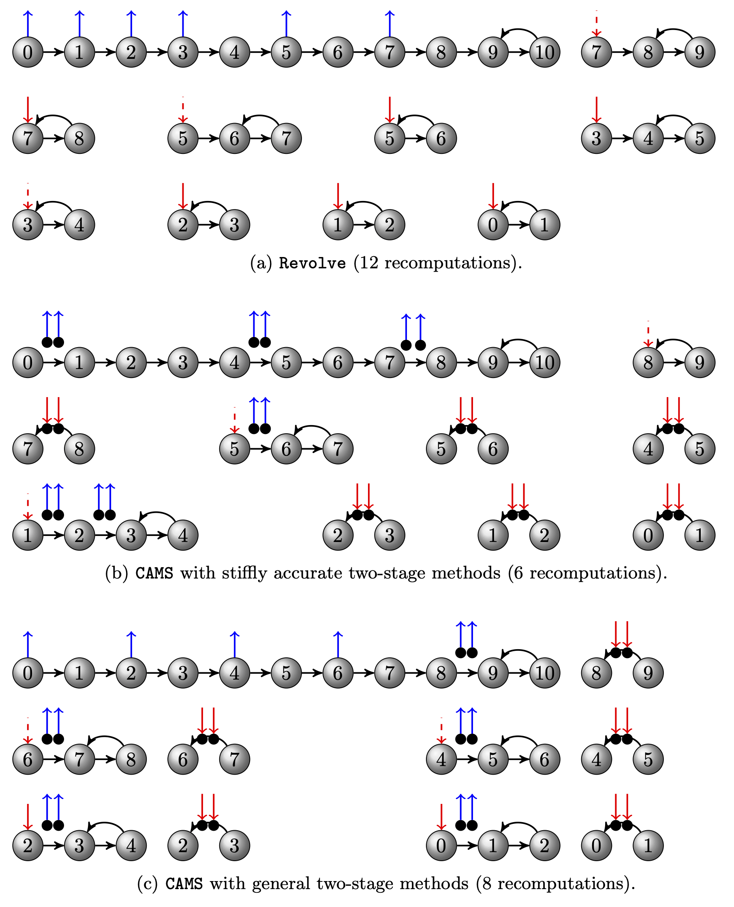

# CAMS: Checkpointing for Adjoint Multistage Schemes

This repository provides an implementation of the CAMS algorithm proposed in

[[1]](https://arxiv.org/abs/1806.07366) Hong Zhang, Emil Constantinescu, "Optimal Checkpointing for Adjoint Multistage Time Stepping Schemes" submitted 2021.

## Installation
`make.inc` needs to be provided. See `make.inc.example` for an example.

Place `make.inc` in the root folder, then do
```
make lib
```

To create a python binding
```
pip3 install .
```

<p align="center">

</p>
